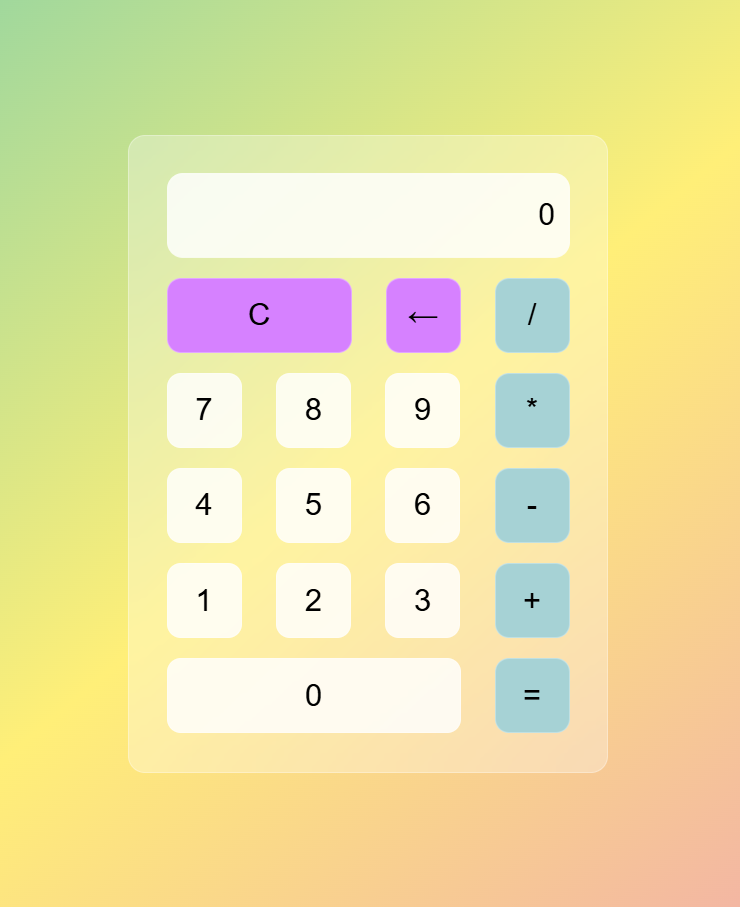

# 🧮 Simple Calculator

A basic calculator built using **HTML, CSS, and JavaScript**.
This project performs simple arithmetic operations and helps understand DOM manipulation and event handling in JavaScript.

## 🚀 Features

* Perform basic operations:

  * Addition (+)
  * Subtraction (−)
  * Multiplication (×)
  * Division (÷)
* Backspace (←) to remove last digit
* Real-time input display
* Clean and simple UI
* Responsiveness

## 🛠️ Technologies Used

* HTML
* CSS
* JavaScript

## 📸 Preview

## 📘 What I Learned

* DOM selection and event listeners
* Handling button clicks
* Updating screen dynamically
* Basic calculator logic using JavaScript

## Live URL
https://juhaib-husain71.github.io/Calculator/

## 👨‍💻 Author

Juhaib Husain
